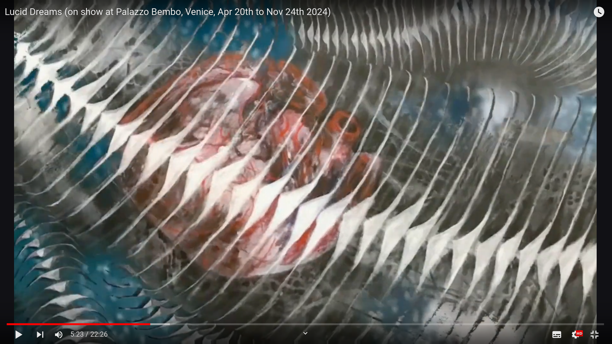

# Heartbeat Chimes

Gentle percussion music composed by the human heartbeat. Unwind, relax, and get back in touch with the natural rhythm of your body while listening to the soothing sound of heartbeat-driven chimes.

## Heartbeats and Music

The heartbeat is one of the most familiar, instantly recognizable and calming rhythms; listening to a heartbeat has been shown to relieve anxiety, lower blood pressure and increase empathy. Heartbeat Chimes play in time with each single heartbeat, creating ever-varying melodies that reflect the constant changes in heart rate. 

This unique combination of a natural heart rhythm and gentle percussion instruments creates a mesmerizing, deeply soothing aural experience that will help you re-center and de-stress, whatever your day throws at you.

## Technology

Heartbeat chimes work with RR intervals from a standard heart rate monitor, of the type used for training - either online, for a live biofeedback experience, or from saved data. Send us your heartbeat data for a personalised melody!

## Applications

Heartbeat chimes are great for

* Re-grounding, fighting anxiety, increasing awareness
* Helping you focus while fending off stress
* As a background for yoga, meditation session

Heartbeat music can also add an intimate, personal dimension to interactive installations and artistic projects

# Events

## Lucid Dreams (Venice, Italy,  Apr 20th - Nov 24th 2024)

The captivating piece "Lucid Dreams" combines a unique fusion of classical and computational visual arts with generative music derived from heart rate variability signals of a sleeping person. It is the result of a cooperation with Beata Maria Rzepecka of Gabriel Fine Arts, Melissa Budasz (alias "Masked Sphinx"). The piece is part of the Personal Structures exhibition, currently open at Palazzo Bembo in Venice, Italy. 

# Contact

Contact us at the address below for

* Personalised music from your RR interval files
* Collaboration in workshops and events
* Art project cooperations

Email: 
